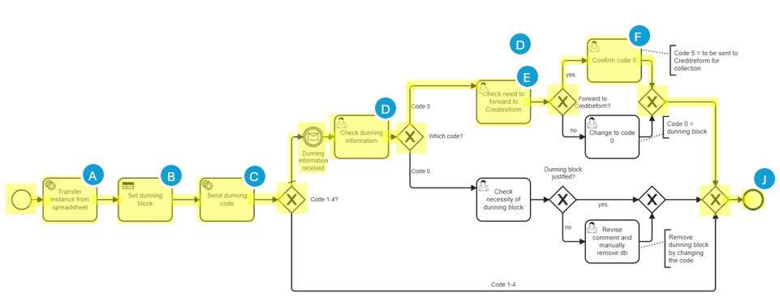
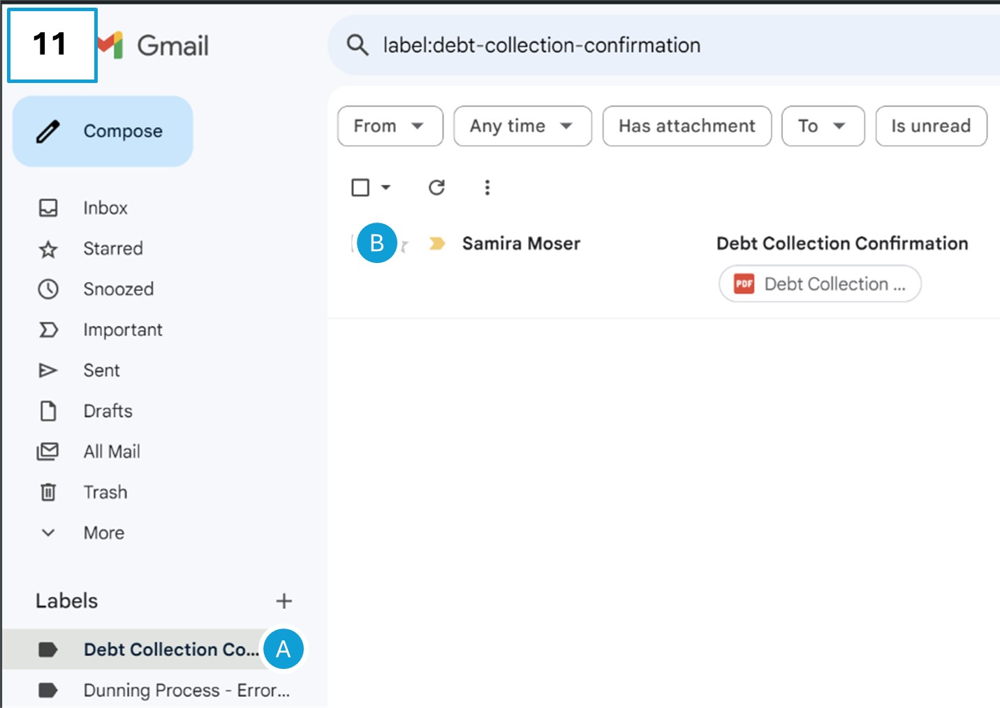
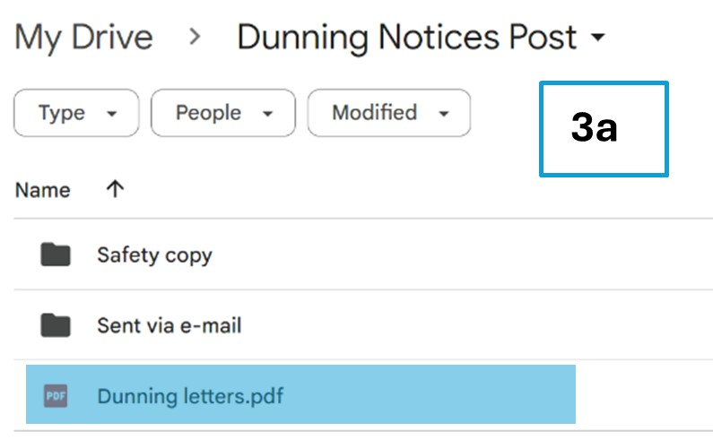
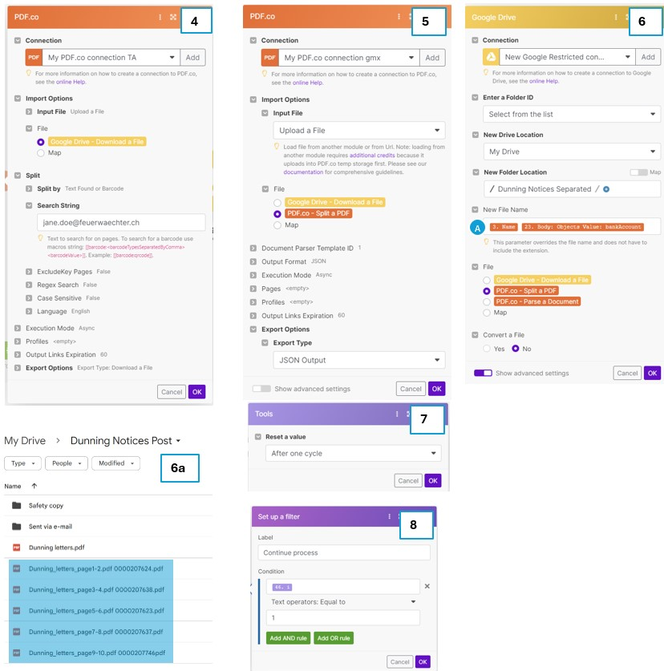
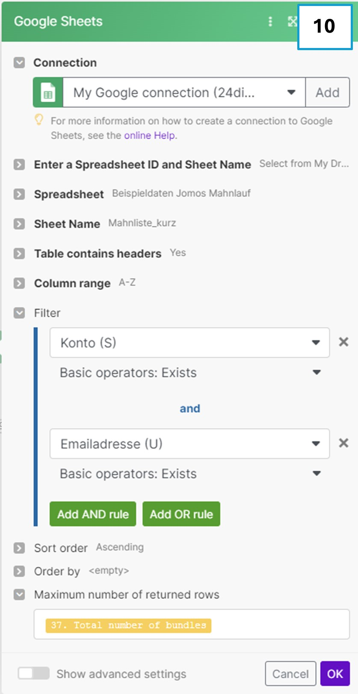
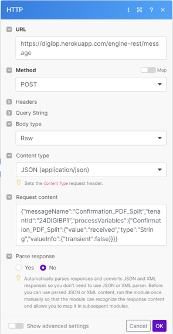

# 🚀 Team-24DIGIBP1
This project was completed during the Spring semester of 2024 as part of the course "Digitalization of Business Processes." The objective of this project was to analyze and model an existing process, identify problems and potential for digitalization, and digitalize the process where it adds value.

## Table of contents
- [👩‍💻 Team Members](#team-members)
- [📚 Background](#background)
- [📝 Short Description of Process](#short-description-of-process)
- [🔍 As-is Process](#as-is-process)
    - [🚩Pain Points / Digitalization Potential](#pain-points--digitalization-potential)
- [🔄 To-be Process](#to-be-process)
    - [🤔 Assumptions](#assumptions)
    - [📄 Description To-Be Process](#description-to-be-process)
  - [🛠️ Technical Implementation](#technical-implementation)
    - [Section 1](#section-1)
    - [Section 2](#section-2)
    - [Section 3](#section-3)
- [▶️ Running the Process](#running-the-process)
- [🙏 Acknowledgements](#acknowledgements)

### 👩‍💻 Team Members 
| Team Members | E-Mail |
|--------------|--------|
|Claudia D'Aniello| claudia.daniello@students.fhnw.ch |
|Samira Nathalie Moser | samiranathalie.moser@students.fhnw.ch|
| Nadia Jakob | nadia.jakob@students.fhnw.ch|

### 📚 Background
The FeuerWächter AG is a SME with 177 employees and is part of the international acting FlameShield Co. FeuerWächter AG is in the field of fire protection and offers many products and services from small extinguishing devices to planning and installation of pressurised smoke protection systems. Their customers include private individuals, companies, architects and construction managers. Since 2018 the FeuerWächter AG is part of the FlameShield Co, who operates in the construction sector. With the takeover, FeuerWächter AG had to adapt to the IT systems of FlameShield Co. The system used by FlameShield Co does not offer the same functionality as the previous ERP system so they were able to only move the financial accounting and controlling parts to the new ERP. The whole management of the construction project stayed in the old system. The invoice data is transferred to SAP via an interface, where it is then processed. The focus of the ERP change was to implement the processes in SAP. Now that these processes are working, the focus is on improving and digitalizing the processes.

### 📝 Short description of Process 
This project focuses on the dunning process, which will be executed every two weeks on Tuesday. The process is mainly located in SAP. Other tools used in the process are an advanced PDF tool, Excel, and Outlook. The modelling is done based on the Dunning run instructions document and further feedback from the finance department. A dunning run includes about 300 reminders, the majority of which are emailed. Around 50 dunning blocks will be set per dunning run. Setting a dunning block does not trigger a dunning notice during the dunning block. A valid reason is required to set a dunning block. The finance department will decide whether the reason is valid or not based on the description.

# 🔎 As-is Process
The BPMN models for all processes mentioned in this readme can be found in the "Models". 

We have divided the AS-IS process into three sections, in the screenshot above, the entire process can be seen with the sections highlighted. The explanation of the process follows these three sections.

**Start Event: Every second Tuesday**

The process starts every 2nd Tuesday, as the dunning run is to take place every two weeks.  

**User Task: Open dunning list**

For this task, the Finance Department opens the dunning list from SAP with all overdue receivables on it that require a follow-up. The list shows the customer concerned, the project concerned, the outstanding amount and other information required to process the outstanding payment.

**User Task: Payment reconciliation**

During payment reconciliation, the Finance Department carries out various checks to see whether the amount is actually still outstanding. It checks any advance payments or double payments, as well as recently received payments, and also compares the items with the bank accounts. This check is carried out on a regular basis, every 2nd or 3rd day, but must also be carried out directly before the dunning run to ensure that no unjustified reminders are issued.

**Exclusive Gateway: Third reminder?**

This gateway checks if this is the third reminder for payment.  
Yes: The process moves to "Transfer case to Creditreform”. This is done from a User directly via Email. Once this has been done, the item is removed from the dunning list as it no longer needs to be taken into account because Creditreform takes care of it.  
No: The process goes on with checking if the dunning block is applicable.

**Exclusive Gateway: Dunning block applicable?**

The gateway decides whether a Dunning block is applicable or not. This is done, for example, in cases such as an error by Feuerwächter AG or a delay in delivery. In these cases, a dunning would be unjustified, as no delivery has yet been made. If a dunning block may be set, this is done directly by the Finance Department (User Task: Set dunning block) and then this item is also removed from the dunning list (Task: Remove instance from dunning list).
If the Dunning block may not be set, the process is continued with the following task.  

**User Task: Export dunning list**

The current Dunning list is exported from SAP as an Excel file.  

**User Task: Send e-mail to Department contacts**

Once the list is available as an Excel file, it is sent by email to the department heads so that they can check the list and add any comments, such as errors by Feuerwächter AG or delays in delivery. This is done via Excel file because the department heads don’t have access to the dunning list on SAP. After all, the department heads are the ones who know best about the current status of their project.

**Timer Event: Two days**

The department heads then have two days to process the Excel reminder list received. If no feedback has been received after two days, the Finance Department assumes that the items as they appear on the list sent are correct and no adjustments are requested by the department head.

**Catch Event: Updated e-mail list received**

If the department heads wish to make adjustments, they must return the corrected and updated email list to the Finance Department before the two-day deadline expires.

**Exclusive Gateway: Dunning block applicable?**

After receiving the list, the Finance Department checks the Dunning blocks again. This time, those requested by the department heads and noted on the Excel list are checked. The Finance Department checks whether these are justified or not. If they are justified, the Dunning block is set directly in SAP (User Task: Set dunning block) and the dunning item is removed from the list (Task: Remove instance from dunning list). If the dunning block is not justified, the item is still taken into account in the process.

**Exclusive Gateway: Dunning address correct?**

This gateway checks if the dunning address mentioned in the dunning list is correct. It may be that a customer does not want invoices and reminders to be sent to the usual main address, but to a branch office or the relevant department with a different address.   
Yes: The process continues to "Execute dunning run."  
No: The process moves to "Correct dunning address." In this step, the Dunning address is corrected manually by a user so that the reminder is sent to the address requested by the customer.

**Execute dunning run**

This task executes the dunning run, preparing the notices for dispatch. This is triggered by a click from a user in SAP.

**Exclusive Gateway: Dunning notice per Mail?**

In this step, the system checks whether an email address is stored for the customer. If this is the case, the reminder is sent by email to the corresponding email address (Service Task: Send Email). If no email address is stored, the reminder is sent by post, for which the following steps are necessary.

**User Task: Download dunning notice**

This task involves downloading the prepared dunning notice for mailing purposes. This is done by a User manually via PDF out of SAP.

**User Task: Separate dunning to send per post notices into individual PDF’s**

This task is performed by an employee of the Finance Department. The employee must sort the PDF, which is generated as a complete document with all reminders in it, so that all reminders that have already been sent by email are no longer included. He can then print out the reminders that still need to be sent by post.

**User Task: Prepare letter**

This task involves preparing the physical letter to be sent out as part of the dunning process.

**User Task: Send letter**

In this step, the prepared letters are taken to the post office and sent to the recipients accordingly.  

**End Event**

The process ends after the letter is sent or the appropriate steps have been completed based on the conditions checked in the gateways.

### 🚩Pain Points / Digitalization Potential
The current process has some points that need improvement.

**Duration of the process**

Specifically, it takes a long time to complete as the initial checks and the export of the dunning list Excel are executed on the first day. This is followed by a two-day waiting period during which the department heads can check their dunning positions and set dunning blocks. The active part of the process starts again after the two-day waiting period. This waiting period unnecessarily prolongs the process and thus needs to be addressed.

**Setting dunning blocks**

The finance department is not directly involved in the projects and therefore lacks awareness about their progress. To address this, the finance department exports a dunning list that contains all the due invoices from the upcoming dunning run. They share this list with the department heads, who then check whether there is a valid reason that the invoices are unpaid. Valid reasons could be any mistakes from the company’s side like delay in delivery of the products or delivering the wrong products. After checking their position on the dunning list for two days, they send the comments back to the finance department. The finance department manually reviews all the comments and validates whether they warrant setting a dunning block. If necessary, they enter the dunning block manually in SAP. This process is prone to errors as everything is done manually, and it involves redundant work as the comments need to be copied into the system.

**Correction of the dunning address**

The company distinguishes between two different billing addresses the “Konto” (Account) and the “Rechnungsempfänger” (invoice recipient). Every customer has one account but can have several different invoice recipients. One Example of that would be a supermarket with several different branches. The company headquarters would be stored as the account and the individual shops as invoice recipients. The invoice goes to the appropriate invoice recipients. However, the dunning notice are sent directly to the account according to the internal business guidelines. In some cases, e.g. smaller companies, the account and the invoice recipient are the same. But if this isn’t the case the financial department has to manually correct the dunning address. This is done in the dunning run and they just copy the account number and replace the invoice recipient with the account number. This is done manually by a user who has to go through every position of the dunning list. This makes it prune to errors and could be automized. 

**Export of the reminders send by post**

When the dunning run is executed, an email with a dunning notice as a pdf in the attachment is automatically sent to customers who have opted to receive dunning notice via email. However, some customers still prefer to receive dunning notice via post. To send these dunning notice via post, the finance department needs to extract a PDF containing all the dunning notice from SAP, save it onto their computer, and manually extract the corresponding PDF from the large PDF file to print it.

# 🔄 To-Be Process
This section addresses the to-be process. The BPMN models for the To-Be Process can be found in the "Models". 

## 🤔 Assumptions
We assumed that a new role in SAP could be created for our to-be process. This role would have limited access. It would have access to open the dunning list and add comments to the corresponding dunning position. However, the role can not make any other changes to the dunning positions or execute a dunning run. The creation of this role would make the process leaner. 

## 📄 Description To-Be Process

The process is triggered every second Thursday instead of Tuesday. The first activity automatically generates an email to the department heads, informing them to check the dunning list and set a dunning block where applicable. With the creation of the new role, the department heads are able to enter a comment directly into the dunning list. The process continues on Tuesday in the Finance Department, where comments of the department heads are classified in a decision table to check whether the dunning block is valid or not automatically. More detailed information about the decision table can be found in [Section 2](#section-2) . The next step involves checking the payment reconciliation by a user, similar to the as-is process. Furthermore, it will be checked whether there is a third reminder or more. If yes, these positions will be separated from the list and will be sent with a copy of the invoice to the CreditReform. When we receive the confirmation that the CreditReform received our request, the process is over for these positions. If it is not the third reminder or more, the list moves on to the task of correcting the dunning address. The detailed description of this task can be found in  [Section 3](#section-3) . Then, the dunning run will be executed by a user. If the customer has an email address stored in the customer database, they will receive an email. If there is no email in the customer database, they will receive the dunning notice by post. The next task is to send the dunning notices by email. Check whether all emails are sent successfully, if not, a user sends them manually. Next, the email status will be automatically checked. If no email is returned, the process is over. If there are emails returned, a user resolves them and the process is over. For dunning notices sent by post, the finance department first downloads all the dunning notices, then they will be separated into separate PDFs. Then the letter gets prepared and sent. The process is over when the letter is sent.

## 💡 Benefits
-	Less manual work 
-	More efficiency due to faster processing
-	Fewer errors due to automation
-	Bundling the finance department process into one day instead of two

## 🛠️ Technical Implementation
In this section, we elaborate the technical implementation. For this purpose, we have divided the process into three sections to make it easier to follow. Within these sections, we have highlighted and numbered parts, which we will elaborate in the following chapters in detail.

### Section 1
In the first section we will discuss the following implementations:
1.	Reminder Dunning Block
2.	Decision Dunning Block

**Reminder Dunning Block**

We have changed the beginning of the process slightly, by moving the start of the entire process from Tuesday to Thursday. Every other week, an e-mail with the reminder to set the dunning block on the overdue invoices is automatically sent to the heads of department (HoD). With the new user roles as discussed in our assumptions above, they are asked to add dunning block were deemed necessary by adding comments directly on SAP (in our case the Excel file).

Figure 1 shows the Camunda diagram, we start the process with a timer start event (Figure 1, A), which triggers on Thursday morning every other week (Figure 2 shows the settings). The task “Send reminder e-mail” then triggers a make scenario (Figure 3), which sends the reminder e-mail to the HoD.

The make scenario is simple, it consists of a webhook (Figure 3, A), which is triggered by the system task. To send the e-mail, we use the Gmail module (Figure 3, B) which is connected to our project e-mail address which then sends out the predefined e-mail to the HoD (Figure 4). The e-mail addresses are static, as we assume that the HoD do not change very frequently, and thus changing them manually if they do, seems a reasonable approach. The e-mail body is written in HTML, to ensure proper formatting of the e-mail. At the end, we have a webhook response module (Figure 3, C), which sends the variable “Reminder_status=successful” back to Camunda (Figure 5). This variable is then needed in Camunda to confirm successful completion of the reminder task. Figure 6 shows the e-mail received by the recipient defined in make.

In Camunda, we added an expression on the flow (Figure 1, B) in between the first timer event and the system task, as “Reminder_status=unsuccessful”. This expression is needed for the exclusive gateway to confirm the reminder was sent successfully by the make scenario. To achieve this, we put an execution listener on the “unsuccessful” arrow (Figure 1, C), looking for the variable “Reminder_status=unsuccessful”. However, if the reminder was sent successfully, this variable will change to “successful” and as a result follow the default path. If there was an issue with the make scenario, an employee will have to check manually what the error might have been, as a user task (Figure 1, D). Finally, the process arrives at the second timer event(Figure 1, E), which will continue the process the following Tuesday.

**Decision Table**

The process for deciding which reminder code to set starts with the service task "Count rows in Spreadsheet." This is needed as preparation for the following subprocess. 

The Make scenario below is initiated by the mentioned service task. The service task triggers the webhook (1), which then consults the dunning run list in SAP (in our case, a Google Spreadsheet) (2).

The consulted dunning list looks like this:

The response returned by the webhook ultimately refers to the number of bundles (rows in the Google Spreadsheet) counted in this Make scenario and is then returned via the Webhook (3) to Camunda. The chosen variable "no" is subsequently used as the loop cardinality for the subprocess. In the above dunning list the variable “no” corresponds to 5.

The subprocess is set up sequentially and is to be executed as many times as the previous Make scenario counts bundles in SAP, i.e., the number of dunning items. The reason for this is that the decision on which reminder Code to set must be made separately for each dunning item. To ensure that the loop cardinality is adjusted if the number of dunning items changes, this was counted using the previous Make scenario and then used as the loop cardinality.

Finally, within the subprocess, another service task "Transfer instance from Spreadsheet" (A) is necessary. This triggers the subsequent Make scenario.

The Make Scenario starts again via the Webhook (1) for the connection to Camunda. Then, in the Google Sheets Search Rows module (2), the dunning run list (Google Spreadsheet) is consulted again to retrieve the dunning items. In the JSON module (3), the three data points from the columns "Kommentar", "Überfällig seit" and "letzter MahnCode" are retrieved, as these are the data needed for the decision table.

 

A filter (4), structured as follows, had to be added between the two modules JSON (3) and Webhook (5). The loopCounter ensures that the sequential execution of the subprocess is not always related to the top row of the Google Spreadsheet, but rather moves to the second row after the first row is checked, and so on. The +1 in the loopCounter is needed to skip the header of the Google Spreadsheet and not start with it. The Webhook (5) ultimately responds back to Camunda with the JSON string.
 

The bundles forwarded from the Make scenario to Camunda are now sequentially checked through the decision table (B) and then follow the path corresponding to the decision. The DMN and the decision table are structured as follows:

The decision table then derives the corresponding decision based on the three inputs: "Kommentar", "Überfällig seit" and "letzter MahnCode". The output from the decision table results in one of the dunning Codes from the following legend:

| DunningCode | Description |
|--------------|--------|
|0| Mahnsperre / Dunning Block |
|1 | Noch nicht fällig / Not yet due|
| 2 | Zahlungserinnerung / Payment reminder|
| 3 | Mahnung mit Betreibungsandrohung / Reminder with enforcement warning|
| 4 | 2. Mahnung mit Betreibungsandrohung / Second reminder with enforcement warning |
| 5 | Weiterleitung an Creditreform - Keine Mahnung / Forward to Creditreform - No reminder| 

Finally, in the “Sending dunning Code” task (C), the Code selected using the decision table is sent back to the dunning list (Google Spreadsheet) and inserted in the  “MahnCode” column, column P, so that it can be processed by the user if necessary. 

This is done using the following make scenario.

First, the “Set variable” tool (2) is used to set up a “Cell name” variable, which is required at a later time. The value of the variable relates to column P and is a sum of the selected line from the dunning run (loopCounter) and 2. The two is required so that the header line and the title line are excluded and therefore correctly start on line 2. After setting the variable, the corresponding cell is selected via the Update Cell module (3) and the correct dunning code is updated in the cell using result.Mahncode.

The filter (4) between the two Google Sheet modules (3 and 5) causes the cells with the code 0 or 5 to be searched for in the dunning list. This filter is required so that only those with 0 or 5 are displayed in the Camunda Task List and the others run through automatically. These rows are then searched for using the Google Sheet module Search Rows (5):

The filter “send message?” (6) is used to compare the calculated row number (sum(1. loopCounter;2) with the actual row number (11. Row number). This ensures that the actions are carried out step by step for the individual relevant rows in a loop and not for all of them at the same time. 

Finally, the HTTP module (7) triggers the intermediate message catch event and provides the listed data (see User Task List Camunda screen), which is finally received and checked by the Finance Department employee in the task list. 

Then, there are three possible paths, continuing from the exclusive gateway triggered by the decision table (B). The result variable for this is set to "result" for the business task, which is then used as a variable in the various sequence flows. The variable then refers to the output "MahnCode" from the decision table and selects one of the three possible paths.

 

First, however, a distinction is made between Codes 1-4 and all others. This means that if Codes 1-4 are set, the process is run through as follows. Since reminder Codes 1-4 do not require any further actions from the user. The subprocess in this cases will directly come to the end event (J).

The second path is selected for all others and then differentiated in the “Which Code” gateway to Code 5 and 0. 

First, however, the receipt of the dunning information is awaited via a message intermediate catch event. As soon as the information has been received via the message event, the user is assigned a task in which he is to check the dunning information received (D). This is displayed as follows: 

This display allows the employee to see all the necessary information directly from the dunning list without having to consult it. The employee therefore has the relevant data to decide what exactly should be done with this claim, whether it should be dunned or not, or whether it should be forwarded to the Credit Reform debt collection agency or not.
Continuing with the second path with Code 0 and therefore dunning block. The setting of this dunning Code must be checked again by the user using the user task “Check necessity of dunning block” (H). The user, in this case the Finance Department employee, must check again whether the dunning block is really justified or not. If the user decides that the dunning block is justified, the process is continued without any changes having to be made and will then end with the end event (J).

If the Finance Department employee decides that the dunning block is unjustified and the item still needs to be dunned, they must revise the comment and change the dunning Code (I) directly in SAP (in our case in the Google Spreadsheet) so that the correct dunning notice is sent.

Finally, there is the third path. This has Code 5 and leads to the corresponding data being forwarded to Credit Reform in section 2 to drive the debt collection there. However, if Code 5 has been decided by the decision table, it must also first be checked manually by a user (E). If the employee comes to the conclusion that forwarding to Credit Reform is required, the employee must confirm Code 5 (F) in the task list.

If Code 5 is not justified and the position is not to be forwarded to Credit Reform, the user must change to Code 0 manually (G) to make sure, that the case will not be forwarded to Credit Reform. 

This process automatization helps that the majority of items can already be decided via the decision table. Some (Code 0 and 5) still have to be checked by a user and by executing the corresponding user tasks, but most of them will be handled automatically.
### Section 2
In the second section we will discuss the following implementations:

3.	Debt Collection
4.	Dunning Address Correction
5.	Splitting Dunning Notices PDF

**Debt Collection**

We partly automated the debt collection process. Before we get to the subprocess, one user and one system task have to be completed. First the payments need to be reconciled again to consider payments that arrived in the meantime since the process was started (Figure 1, A). Next, the Code allocated to the unpaid invoices needs to be checked, if a dunning notice will be sent to the customer, or if the invoice is handed over to the debt collection office CreditReform (Figure 1, B1). This check is performed automatically using a make scenario (Figure 3) which is initiated by the system task. The message catch event (Figure 1, B2) is added to receive the variables indicating what types of dunning Code are included in the current run, there are two variables, Code5 and CodeOther. Both of the variables can be true at the same time, however Code5 does not always have to be true, therefore we use the OR-gateway (Figure 1, C) to direct the process flow, either going both directions or just down and skipping the dept collection subprocess. The configuration of the message event is shown in Figure 2.

The identification of Codes included in the dunning run are done in a make scenario (Figure 3). First a “Webhook” module (Figure 3, A) is triggered by the system task in Camunda (Figure 1, B1). Next, we consult the dunning list using the “Google Sheets Search Rows” module (Figure 3, B), where we retrieve all values from the list (Figure 4). Using the “Tools Table aggregator” module (Figure 3, C), we create an aggregation of all the dunning Codes included in the current run (Figure 5). The “Router” module (Figure 3, D) splits the scenario flow into two to account for the two possible outcomes. Namly that Code 5 is included beside other Codes or that Code 5 is not included. For this reason, a filter directs the flow accordingly by assessing whether the text (i.e. the aggregated Code numbers) contain Code 5 (Figure 6). If this validates to true, the process passes through, otherwise it goes the other direction of the default flow. Lastly, to send the information back to Camunda to pass through the OR-gateway, a “HTTP” module (Figure 3, F) is used to send the variables back. In case Code 5 is included, both variables are set to “true” otherwise only the CodeOther variable is set to true and Code5 to false (Figure 7).

   

Assuming that dunning notices with Code 5 were identified, we move on to the debt collection subprocess. First an employee needs to send an e-mail to the debt collection office CreditReform with the overview of positions that they will have to handle (Figure 1, D). Afterwards we arrive at an event-based gateway (Figure 1, E) where we wait for one of two things to happen, either a confirmation of receipt is sent back by CreditReform (Figure 1, F) or three days pass by without any notice (Figure 1, G). If no notice is obtained, an employee needs to follow-up with CreditReform (Figure 1, H). The check, whether a confirmation was obtained is automated using a make scenario. (Figure 7) consisting of four modules. First, we use the “Gmail Watch e-mails” module (Figure 7, A) to look out for the confirmation of the debt collection office. We configured the module (Figure 8) to look out for e-mails in the inbox with a specific subject line “Debt Collection Confirmation”, we use this approach to identify the e-mail, as we would expect the e-mail to be a standard e-mail with the same subject every time. Of course, if the sender would always be the same, then this could also be incorporated as an identification 

Once the e-mail has been identified, the attachment with the overview of the invoices in debt collection are automatically filed using the “Google Drive Upload a File” module (Figure 7, B). For this purpose, we use the information of the first module “Watch e-mails” to specify the attachment and its name and data (Figure 9). Figure 9a shows the filed attachment on Google Drive.

  

Following the attachment filing, using the module “Gmail move an e-mail” (Figure 7, C), we move the e-mail from the inbox to a specific folder, where all the confirmation e-mails are stored for audit purposes (Figure 10). Figure 11 shows the inbox, label A indicates the inbox to which the e-mail was moved and label B the confirmation e-mail we received.

 

Lastly, to allow the process to proceed in Camunda, we use an HTTP module (Figure 7, D) to send the confirmation of successful completion back to Camunda. We configured the body of the message to contain the message name as defined in the receive task in Camunda and send the variable “Debt_Collection_Confirmation=received”, which triggers the continuation of the process (Figure 12).

 

**Dunning address correction**

 

The correct dunning address task will use all the “Debitornummer” from each position on the dunning list to match them to the Master database, where the “Debitornummer” will be matched. If they are matched, information like the customer's name, the “Konto,” the postal address, and the email address (where applicable) will be added to the dunning list sheet. This will be done with a make scenario. 

**Splitting of the PDF**

Dunning notices, which do not have an e-mail address associated have to be sent via post. For this purpose, a PDF file, containing all Dunning notices of the current run, has to be downloaded from SAP which is then split into individual notices and the ones to be sent via post are printed for further processing. In this part of the process, we are looking into the splitting of the PDF file (Figure 1).
 

The service task to initiate the splitting of the PDF file (Figure 1, B) is activated once the PDF file has been downloaded in the previous user task (Figure 1, A). It will then take the large PDF containing all dunning notices, split them, sort them by moving all notices which have been sent via e-mail to a different folder, and renaming the notices to be sent via Post indicating the customer’s name and account for easy identification. This is modelled in make using three scenarios (Figures 2a, 2b, and 2c).
 

We first start with scenario 2a, where a webhook triggered by the Camunda service tasks initiates the process (Figure 2a, A1). To continue the process flow within Camunda, we directly use the “Webhook Response” module (Figure 2a, A2), since no additional information needs to get back to the Camunda process until the third make scenario in the PDF splitting part. 

In the process diagram (Figure 1), we now move on from the service task to the event gateway (Figure 1, C). This is set-up similarly to the event gateway of the debt collection confirmation. In this case we wait to either receive a confirmation that the PDFs were successfully split (Figure 1, D) or that 30 minutes have passed (Figure 1, E), in which case manual intervention is required (Figure 1, F). The confirmation generation is modelled in the third make scenario (Figure 2c).

After the initiation of the make scenario, we then proceed to search for the PDF file using the “Google Drive Search for Files/Folders” module  (Figure 2a, B) within the folder “Dunning Notices Post” (Figure 3). Figure 3a shows the Google Drive folder with the file that needs to be split. Then we download the file using the “Google Drive Download a File” module (Figure 2a, C) for further processing (Figure 4).

   

Next, we use the “PDF.co Split a PDF” module (Figure 2a, D) that allows processing of PDFs in various ways. First, we separate the large PDF into the individual notices, using the e-mail address of Feuerwächter AG’s contact person listed within the PDF file as the indicator of a new notice and as such where to cut the file (Figure 4). In the next module, “PDF.co Parse a Document” (Figure 2a, E), the separated PDF files are parsed (Figure 5). We do this, to obtain information from within the PDF files to give the PDFs useful names. This is done in the next step, using the “Google Drive Upload a File” (Figure 2a, F) module where we upload the individual PDFs back into the folder where the initial file is stored (Figure 6). The files initially were only named by their pages within the large file, with the parsing however, we can add the customers’ account numbers to make them identifiable (Figure 6, A). Figure 6a shows the output of this upload and renaming.
 

To end the first make scenario, we need to initiate the second scenario. For this purpose, we use the “HTTP Make a request” module (Figure 2a, I). However, we have several documents PDF files that are generated, but only need the following scenario to be initiated once. For this reason, we use the “Tools Increment function” module (Figure 2a, G), which gives each cycle (document output) a number. We then use the filter (Figure 2a, H), to only pass on the first one.

 
The goal of the second make scenario (Figure 2b) is to move all PDF dunning notices which have already been sent to the customers via e-mail into a different folder. This is intended to ensure only the dunning notices intended to be sent via post are sent in the end. As indicated above, the scenario starts with a webhook module (Figure 2b, A) which is triggered by the previous HTTP module (Figure 2a, I). Following right after the scenario initiation the “Tools Sleep” module (Figure 2b, B) pauses the scenario for 4 minutes (240 sec), to give the first scenario enough time to upload all the individual PDF notices (Figure 8).

 
Once the timer is up, the scenario continues with the search for the individual PDF dunning notices using the “Google Drive Search for Files/Folder” module (Figure 2b, C). As search query, we use the part of the file names that are the same for all of them “Dunning_letters” (Figure 9). To determine, whether a dunning notice was sent via e-mail, we have to compare against the dunning list, which we store as a Google Sheet. To achieve this, we use the “Google Sheets Search Rows” module (Figure 2b, D) and look up the file in the corresponding tab. Only entries that have an e-mail address associated and where the lines are not empty are selected (Figure 10). Before we move on to the next module, we added a filter (Figure 2b, E) comparing whether a file, based on its name, contains the account number according to the Google sheet search (Figure 11). Only the files where this comparison is true move on to the next module.

   

We use the “Google Drive Move a File/Folder” module (Figure 2b, F) to move the files to a separate folder. Based on the evaluation using the filter, we know which files should be moved, because they have already been sent via e-mail (Figure 12). Figure 12a shows the dunning notices moved to the separate folder “Sent via e-mail”. Before we send the HTTP request, we also add a “Tools Increment function” module (Figure 2b, G), to give each cycle (or file in this case) a number (Figure 13). This number is then used in the following filter (Figure 2b, H), where only the first cycle passes through to initiate the HTTP request (Figure 14), since only one initiation of the third scenario is needed. To finalize the scenario, we use the HTTP module (Figure 2b, I) to trigger the Webhook of the third scenario.

 

 
The third make scenario (Figure 2c) is very similar to the second on with three exceptions. The first difference is in the “Google Sheets Search Rows” module (Figure 2c, D), where we look for the customers that do not have an e-mail address associated, since we want to identify the customers that will receive the dunning notice by post (Figure 15). The second difference is the “Google Drive Update File” module (Figure 2c, F), in this case we don’t want to move any files but rename them using the customer’s name and account number (Figure 16). Figure 16a shows the updated files in Google Drive. The last difference lies in the execution details of the “HTTP Make a request” module (Figure 2c, I). The message in this case is not directed at another make scenario, but at Camunda in order to pass the event-based gateway (Figure 1, C) toward the message catch event (Figure 1, D). To do this, we send a message, similar to the debt collection confirmation, where we indicate the message name based on the message configured in Camunda sending the variable Confirmation_PDF_Split=received (Figure 17). Once the message has been received the subprocess is finalized.

 
 
  

The remaining scenario works the same way as the second one (Figure 2b). After the Webhook module (Figure 2c, A), the “Tools Sleep” module (Figure 2c, B) is initiated, pausing for 2 minutes (120 sec) to give the first scenario enough time to upload all the individual PDF notices (Figure 18).

 
Once the timer is up, the scenario continues with the search for the individual PDF dunning notices using the “Google Drive Search for Files/Folder” module (Figure 2c, C). As search query, we use the part of the file names that are the same for all of them “Dunning_letters” (Figure 19). To determine, whether a dunning notice will be sent via post, we compare against the dunning list, as explained above using the Google Sheet search (Figure 2c, D). Only entries that have an e-mail address associated and where the lines are not empty are selected (Figure 15). Before we move on to the next module, we added a filter (Figure 2c, E) comparing whether a file, based on its name, contains the account number according to the Google sheet search (Figure 20). Only the files where this comparison is true move on to the next module.

 
As explained above already, next we rename the files using the Google Drive update module (Figure 2c, F). Before we send the HTTP request, we also add a “Tools Increment function” module (Figure 2c, G), to give each cycle (or file in this case) a number (Figure 21). This number is then used in the following filter (Figure 2c, H), where only the first cycle passes through to initiate the HTTP request (Figure 22), since only one message to Camunda is needed. After that, the third scenario is finalized using the HTTP request module (Figure 2c, I).

 

### Section 3
In the third section we will discuss the following implementations:

6.	Dunning Letters via Post
7.	Dunning Letters via E-mail

**Dunning Letters via Post**

Sending the dunning notices via post is of course a manual process (Figure 1), which we modelled as a subprocess. Firstly, the letters need to be prepared, meaning the PDF files we split previously in section 2, part 5 need to be printed and put in an envelope (Figure 1, A). Next, the letters are sent via post (Figure 1, B). Afterwards, the process waits for seven days, to ensure all letters were received and none are returned (Figure 1, C). We chose seven days as a waiting period, as Feuerwächter AG’s customers are within Switzerland and we assume that this time period should be enough, to have the letter returned. The timer event configuration can be seen in Figure 2. After the waiting period, an employee needs to check if any letters were returned, if not, the process ends (Figure 1, D). For this purpose, we have added form fields to the user task (Figure 3), the settings of the form can be seen in Figure 4. On the outgoing arrows of the exclusive gateway, we added the conditions of the form, see configuration in Figure 5 for the “no” condition as an example.

If a letter is returned, an employee needs to try and contact the customer to inquire about the correct address (Figure 1, F).Here we have added again a form, for the employee to select whether he was able to reach the customer (Figure 6), the settings of the form are the same as in Figure 4 and 5 with the exception of the name of course. If the customer cannot be reached, the employee needs to contact the commune to obtain the correct address (Figure 1, H). After receiving correct address, the customer’s data has to be updated (Figure 1, I) and the letter resent (Figure 1, J).

**Dunning Letters via E-mail**

To send the dunning notices via e-mail, we have created a subprocess to automatically send the e-mails to the customers including the attachment with the dunning notice (Figure 1). First a system task initiates the sending of the dunning notice (Figure 1, B), we then check for errors during the processing. Once the successful sending could be confirmed, we check if any e-mails were returned due to invalid e-mail addresses with a message receive (Figure 1, F) and timer task (Figure 1, G). The set up of the assessment of successful e-mail sending is similar to the start of the process, where we also check if the reminder e-mail was sent as intended. For this reason, we add again a variable to the flow (arrow) between the start event and the system task (Figure 1, A) with the variable “Dunning_status=unsuccessful”. The system task “Send dunning email” triggers the make scenario (Figure 2).

After the scenario has been triggered by the webhook module (Figure 2, A), we perform a search in the dunning list in Google Sheets, using the “Google Sheets Search Rows (Advanced)” module (Figure 2, B), to identify all the customers with an e-mail address associated (Figure 3). In the actual process, SAP is used to send the dunning notices via e-mail automatically, we simulate this for our project. Since we cannot retrieve the PDF files, we use a Google Drive folder in which we filed the dunning notices which will then be sent as attachments. Therefore, based on the results of the Google Sheets search, we access this Google Drive folder and search for the relevant files, using the “Google Drive Search for Files/Folders” module (Figure 2, C), based on the customer account number (Figure 4). In the following Google Drive module, “Download a File” (Figure 2, D), the individual PDFs are downloaded.

 
We use the Gmail module “Send an E-mail” (Figure 2, E), to send out the dunning notices. We retrieve the e-mail addresses from the Google Sheet, composed the e-mail body using HTML format and add the downloaded PDF dunning notices as attachments (Figure 5). Lastly, a confirmation is sent to Camunda, using the “Weebhook response” module (Figure 2, F), to continue with the process, by sending the variable “Dunning_status=successful” (Figure 6).

 
In Camunda, we use an exclusive gateway (Figure 1, C), to determine whether the sending of the e-mail was successful or not. If the scenario in make did not run properly, then no variable will have been returned, and the variable we added at the beginning of the process (Figure 1, A), will remain active. As a result, at the gateway the “unsuccessful” direction will be taken, and manual intervention will be required. If, however, the scenario ran successfully, the process can continue to the event based gateway (Figure 1, E). This gateway was added to catch returned e-mails due to invalid e-mail addresses. Therefore, we will wait for one of two events to happen, either 30 minutes pass by (Figure 1, G) or a message is sent to Camunda with the information that an e-mail has been returned (Figure 1, F). In that case, manual intervention is required to assess the issue and to contact the client to correct the e-mail address or send the notice via post (Figure 1, H). The identification of returned e-mails is done using a make scenario (Figure 7).

Similar to the debt collection confirmation, the trigger of the scenario is a Gmail “Watch E-mails” module (Figure 7, A). In that module we are watching for e-mails from the mailer-daemon service informing about delivery issues (Figure 8). Once an e-mail has been identified, we use the “Gmail Move an Email” module (Figure 7, B) to move it to a specific folder where all error messages are saved (Figure 9). Lastly, to inform Camunda of the error, a message is sent via HTTP request (Figure 7, C), in which we send the message that an error has occurred (Figure 10).

## ▶️ Running the Process

Follow these instructions to run the process:
- Download the Camunda files 
- Open the files in Camunda 7
- deploy the Proess incl. the forms 

## 🙏 Acknowledgements
We would like to thank our coaches, Andreas Martin and Charuta Pande, for their invaluable guidance and unwavering support throughout this project. 

